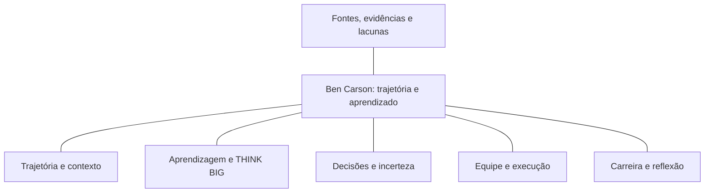

# Mapa de conhecimento — Ben Carson

Este mapa organiza o estudo da trajetória, do aprendizado e das decisões profissionais de Ben Carson. É uma **adaptação editorial resumida** da nota “Ben Carson — Segundo Cérebro”, existente no caderno “Ben Carson Brain”; não é uma transcrição da nota nem uma exportação automática do NotebookLM.

As linhas representam **relações entre temas de estudo**, não relações de causa e efeito comprovadas.

## Como explorar cada ramo

| Ramo | Pergunta orientadora | Registro que deve resultar do estudo |
| --- | --- | --- |
| Trajetória e contexto | Quais acontecimentos estão documentados e como o próprio autor os interpreta? | Linha do tempo com fonte de cada evento; relatos pessoais identificados como tais. |
| Aprendizagem e THINK BIG | Quais hábitos e valores aparecem na narrativa? Como o modelo pessoal THINK BIG organiza essas ideias? | Síntese dos princípios descritos, exemplos citados e perguntas para aplicação ao próprio estudo. |
| Decisões e incerteza | Qual era o problema, quais informações estavam disponíveis e o que permanece desconhecido? | Ficha de análise de decisão, com alternativas e riscos apenas quando sustentados pelas fontes. |
| Equipe e execução | Quais pessoas, funções e condições de trabalho aparecem na documentação? | Mapa de contribuições, responsabilidades e coordenação, sem atribuir todo o resultado a uma pessoa. |
| Carreira e reflexão | Como experiências de diferentes momentos se conectam no material consultado? | Comparação entre episódios e lições propostas pelo autor, separadas da interpretação de quem estuda. |
| Fontes, evidências e lacunas | Qual fonte é adequada para responder a esta pergunta? O que ela permite concluir? | Afirmação, referência, tipo de evidência e limite de cada conclusão. |

## Roteiro para analisar um episódio

**Problema → informações → alternativas → riscos → decisão → execução → resultado → aprendizado.**

Esse roteiro estrutura a investigação; não presume que todos os passos estejam documentados. Se uma fonte relata apenas a decisão e o resultado, registre as outras etapas como “não documentadas nas fontes consultadas”. Um resultado favorável, sozinho, não comprova a qualidade de todo o processo decisório.

Exemplo de conexão conceitual: um mesmo episódio pode ser estudado em **decisão**, pelas informações disponíveis, e em **equipe**, pela divisão de responsabilidades. Isso não autoriza afirmar que determinado hábito ou valor causou o resultado.

## Critério para navegar pelas fontes

Não há uma hierarquia universal: escolha a fonte conforme a pergunta. Uma autobiografia é apropriada para estudar a narrativa do autor; uma entrevista permite examinar o que ele declarou naquele contexto; documentação institucional ajuda a conferir marcos profissionais; artigos originais permitem investigar métodos e resultados descritos pelos pesquisadores. Compare fontes quando elas tratam da mesma afirmação e registre diferenças de data, escopo ou perspectiva.

Relatos médicos históricos devem ser situados em sua época. O mapa serve ao estudo de trajetória e aprendizagem; não transforma episódios biográficos em recomendações clínicas atuais.

## Próximas leituras

- [Miniguia de estudo](miniguia.md): síntese e glossário.
- [Curadoria de fontes](../sources/fontes.md): referências selecionadas para a documentação pública.
- [Nota-base adaptada](../notebooklm/nota-base.md): princípios para conduzir a investigação.
- [Prompt para gerar um mapa mental](../notebooklm/prompt-mapa-mental.md): roteiro reutilizável com referências e lacunas.
